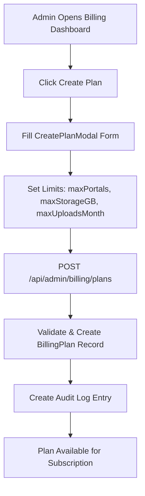
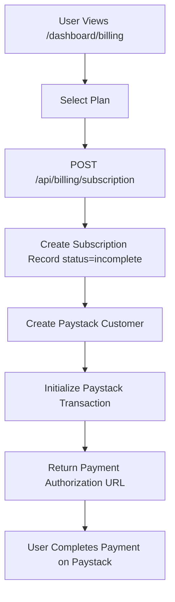
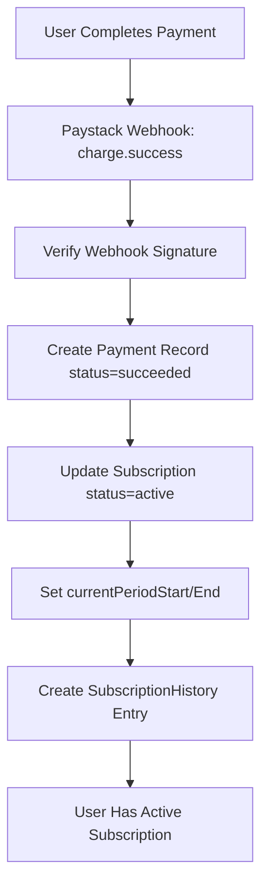
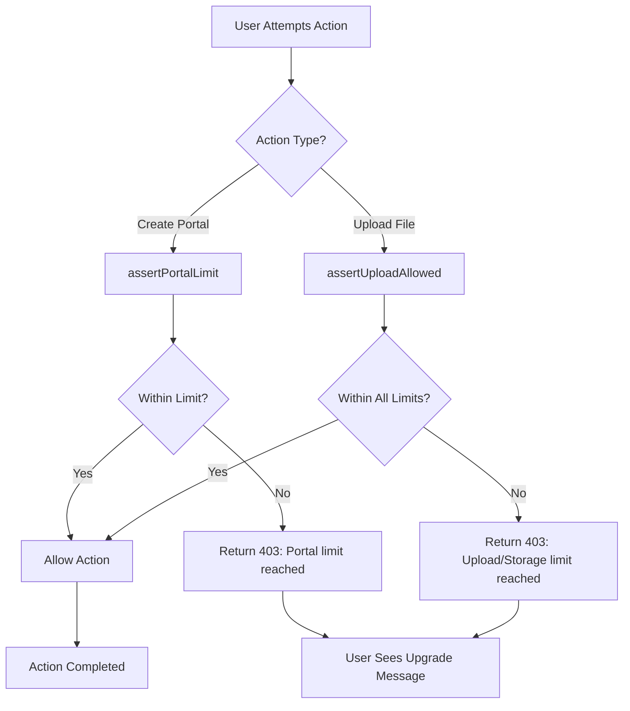
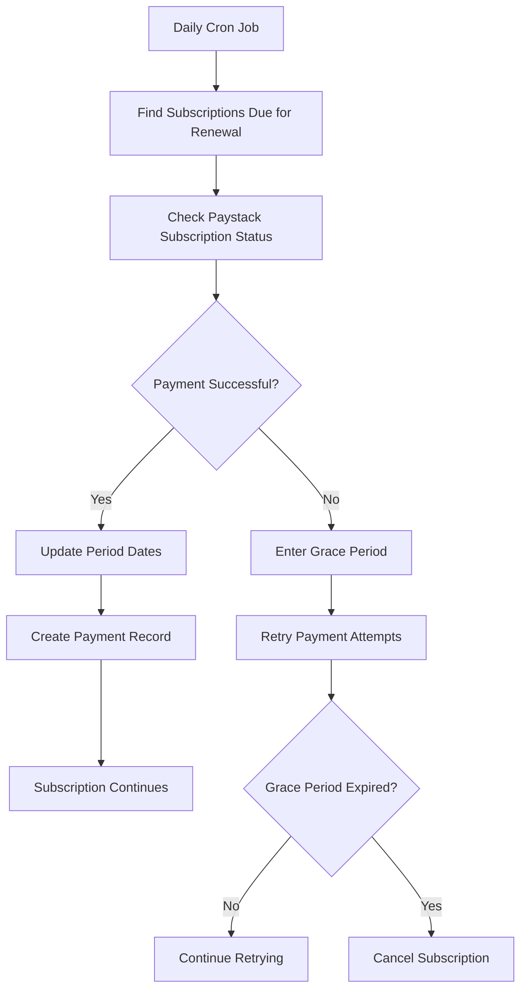

# Complete Billing System Documentation

## Overview

This application implements a comprehensive subscription billing system using Paystack as the payment provider. The system supports plan-based subscriptions with feature limits, automatic renewals, proration for plan changes, and complete admin management capabilities.

## Architecture Components

### Core Models
- **BillingPlan**: Defines subscription plans with pricing and limits
- **Subscription**: User's active subscription to a plan
- **Payment**: Individual payment records and transactions
- **SubscriptionHistory**: Audit trail of subscription changes

### Payment Provider
- **Paystack Integration**: Handles payments, subscriptions, and webhooks
- **Automatic Renewals**: Monthly/yearly recurring billing
- **Webhook Processing**: Real-time payment status updates

## Admin Plan Management

### Creating Billing Plans

Admins access the billing management interface at `/app/admin/billing/` which provides a comprehensive dashboard with three main sections:

#### Plan Creation Interface
The `CreatePlanModal` component allows admins to define:

**Basic Information:**
- Plan name (unique identifier)
- Description (optional marketing text)
- Price (in specified currency)
- Currency (USD, NGN, etc.)
- Active/inactive status

**Feature Limits:**
- `maxPortals`: Maximum portals user can create (-1 = unlimited)
- `maxStorageGB`: Total storage limit in GB (-1 = unlimited)  
- `maxUploadsMonth`: Monthly upload limit (-1 = unlimited)
- `features`: Array of feature descriptions for display

#### Plan Management Operations

**Create Plan:**
```http
POST /api/admin/billing/plans
{
  "name": "Professional",
  "description": "For growing businesses",
  "price": 29.99,
  "currency": "USD",
  "features": ["10 portals", "100GB storage", "Unlimited uploads"],
  "maxPortals": 10,
  "maxStorageGB": 100,
  "maxUploadsMonth": -1,
  "isActive": true
}
```

**Update Plan:**
```http
PUT /api/admin/billing/plans/{planId}
```

**Delete Plan:**
```http
DELETE /api/admin/billing/plans/{planId}
```
- Requires migration of existing subscribers to another plan
- Uses `DeletePlanModal` to handle subscriber migration

### Admin Dashboard Features

#### Subscription Management
- View all user subscriptions with search and filtering
- Monitor subscription status (active, cancelled, past_due)
- Access payment history for each subscription
- Cancel subscriptions manually
- View user details and plan information

#### Analytics Dashboard
- **Revenue Metrics**: Total revenue, MRR (Monthly Recurring Revenue), ARPU (Average Revenue Per User)
- **Subscription Metrics**: Total, active, cancelled, recent subscriptions
- **Churn Rate**: Percentage of cancelled subscriptions
- **Plan Distribution**: Subscriber count per plan
- **Payment Status**: Success/failure rates by status

## Feature Definition and Limits

### Plan Structure

Each billing plan defines three core limits:

```typescript
interface BillingPlan {
  id: string
  name: string
  description?: string
  price: number
  currency: string
  features: string[]        // Display features for UI
  maxPortals: number        // Portal creation limit
  maxStorageGB: number      // Total storage limit
  maxUploadsMonth: number   // Monthly upload limit
  isActive: boolean
}
```

### Free Plan (Fallback)

Users without active subscriptions automatically get the free plan:

```typescript
const FREE_PLAN = {
  id: "free",
  name: "Free",
  price: 0,
  currency: "USD",
  features: ["1 portal", "1GB total storage", "100 uploads per month"],
  maxPortals: 1,
  maxStorageGB: 1,
  maxUploadsMonth: 100
}
```

### Unlimited Features

Setting any limit to `-1` makes it unlimited:
- `maxPortals: -1` = Unlimited portals
- `maxStorageGB: -1` = Unlimited storage
- `maxUploadsMonth: -1` = Unlimited monthly uploads

## Billing Limits Enforcement

### Enforcement Points

The system enforces billing limits at three critical points:

#### 1. Portal Creation (`/api/portals/route.ts`)

```typescript
// Before creating a new portal
await assertPortalLimit(session.user.id)
```

**Check Logic:**
- Count existing portals for user
- Compare against `plan.maxPortals`
- Throw error if limit exceeded

#### 2. File Upload (`/api/upload/route.ts`)

```typescript
// Before processing file upload
await assertUploadAllowed(portal.userId, file.size)
```

**Triple Check Logic:**
1. **Monthly Upload Limit**: `uploadsThisPeriod >= plan.maxUploadsMonth`
2. **Total Storage Limit**: `currentStorage + fileSize > plan.maxStorageBytes`
3. **Single File Limit**: `fileSize > plan.maxStorageBytes`

#### 3. Upload Sessions (`/api/upload/session/route.ts`, `/api/upload/chunked/init/route.ts`)

Same enforcement for different upload methods (direct, chunked, session-based).

### Usage Calculation

The `getUserUsage()` function calculates current usage:

```typescript
const usage = {
  portalCount: COUNT(uploadPortals WHERE userId=X),
  uploadsThisPeriod: COUNT(fileUploads WHERE userId=X AND createdAt BETWEEN periodStart AND periodEnd),
  storageBytes: SUM(fileUploads.fileSize WHERE userId=X)
}
```

### Billing Period Tracking

- **Active Subscription**: Uses `subscription.currentPeriodStart` to `currentPeriodEnd`
- **Free Plan**: Uses calendar month (1st to last day of current month)
- **Period Reset**: Occurs on subscription renewal date

## Complete Billing Flow

### 1. Admin Creates Plan



### 2. User Subscribes to Plan



### 3. Payment Processing & Activation



### 4. Feature Enforcement in Action



### 5. Subscription Renewal



## Subscription Management

### Subscription States

- **`active`**: Fully functional, recurring charges enabled
- **`incomplete`**: Awaiting initial payment authorization
- **`past_due`**: Payment failed, in 7-day grace period
- **`cancelled`**: User cancelled or grace period expired

### User Actions

#### Cancel Subscription
```http
DELETE /api/billing/subscription
```
- Sets `cancelAtPeriodEnd = true`
- Subscription remains active until period end
- No further charges after current period

#### Change Plan
```http
POST /api/billing/subscription/change-plan
{
  "newPlanId": "plan_xyz",
  "effectiveDate": "immediate", // or "next_period"
  "prorateBilling": true
}
```

**Proration Logic:**
- Calculate daily rates for old and new plans
- Credit unused portion of old plan
- Charge prorated amount for new plan
- Create payment record for difference

### Admin Actions

- **View All Subscriptions**: Filter by status, search by user
- **Cancel User Subscriptions**: Emergency cancellation capability
- **View Payment History**: Complete transaction history per user
- **Plan Migration**: When deleting plans, migrate subscribers

## Payment Processing

### Payment Flow Architecture

1. **Initialization**: Create Paystack transaction with plan amount
2. **Authorization**: User authorizes payment on Paystack
3. **Webhook Confirmation**: Paystack confirms payment via webhook
4. **Activation**: Subscription activated with stored authorization
5. **Recurring**: Future renewals use stored authorization automatically

### Webhook Event Handling

The system processes these Paystack webhook events:

- **`charge.success`**: Payment succeeded → activate subscription
- **`charge.failed`**: Payment failed → enter grace period
- **`subscription.enable`**: Subscription activated by Paystack
- **`subscription.disable`**: Subscription cancelled by Paystack
- **`invoice.payment_succeeded`**: Renewal payment succeeded
- **`invoice.payment_failed`**: Renewal payment failed

### Invoice Generation

```http
GET /api/billing/invoices/{paymentId}
```
- Generates PDF invoice using pdfkit
- Includes payment details, amount, status
- Available for download from billing history

## Usage Tracking & Metering

### Tracked Metrics

1. **Portal Count**: Total portals created by user (lifetime)
2. **Monthly Uploads**: File uploads in current billing period
3. **Storage Usage**: Total file storage across all portals (bytes)

### Calculation Methods

```sql
-- Portal Count (lifetime)
SELECT COUNT(*) FROM uploadPortals WHERE userId = ?

-- Monthly Uploads (current period)
SELECT COUNT(*) FROM fileUploads 
WHERE portal.userId = ? 
AND createdAt BETWEEN ? AND ?

-- Total Storage (lifetime)
SELECT SUM(fileSize) FROM fileUploads 
WHERE portal.userId = ?
```

### Period Boundaries

- **Subscription Users**: `currentPeriodStart` to `currentPeriodEnd`
- **Free Plan Users**: Calendar month (UTC 1st to last day)
- **Reset Timing**: On subscription renewal date

## Error Handling & User Experience

### Limit Exceeded Messages

When limits are reached, users receive specific error messages:

- **Portal Limit**: "Portal limit reached for your plan (X). Upgrade to add more portals."
- **Upload Limit**: "Upload limit reached for this billing period (X). Upgrade your plan to continue uploading."
- **Storage Limit**: "Storage limit exceeded for your plan (XGB total). Delete files or upgrade your plan."

### Grace Period Handling

When payments fail:
1. Subscription enters `past_due` status
2. 7-day grace period begins
3. Daily retry attempts for payment
4. User retains access during grace period
5. After 7 days: subscription cancelled, access restricted

### Plan Change UX

- **Immediate Changes**: Proration calculated and charged/credited
- **Next Period Changes**: Scheduled for next billing cycle
- **Upgrade Path**: Clear messaging about increased limits
- **Downgrade Warnings**: Alert if current usage exceeds new limits

## Security & Compliance

### Webhook Security
- Paystack signature verification using HMAC-SHA512
- Reject webhooks with invalid signatures
- Environment-specific webhook secrets

### Data Protection
- PCI compliance through Paystack (no card data stored)
- Audit logging for all billing operations
- Secure API endpoints with authentication

### Access Control
- Admin-only access to billing management
- User-specific subscription data isolation
- Role-based permissions for billing operations

## Configuration & Environment

### Required Environment Variables
```env
PAYSTACK_SECRET_KEY=sk_test_xxx
PAYSTACK_PUBLIC_KEY=pk_test_xxx
PAYSTACK_WEBHOOK_SECRET=whsec_xxx
CRON_SECRET=your_cron_secret
```

### Database Migrations
All billing tables are defined in `prisma/schema.prisma`:
- BillingPlan
- Subscription  
- Payment
- SubscriptionHistory

### Deployment Considerations
- Webhook endpoint must be publicly accessible
- Cron job for renewal processing (daily)
- Database indexes on userId, status, dates for performance
- Error monitoring for payment failures

This billing system provides a complete, production-ready subscription management solution with robust limit enforcement, comprehensive admin tools, and seamless user experience.