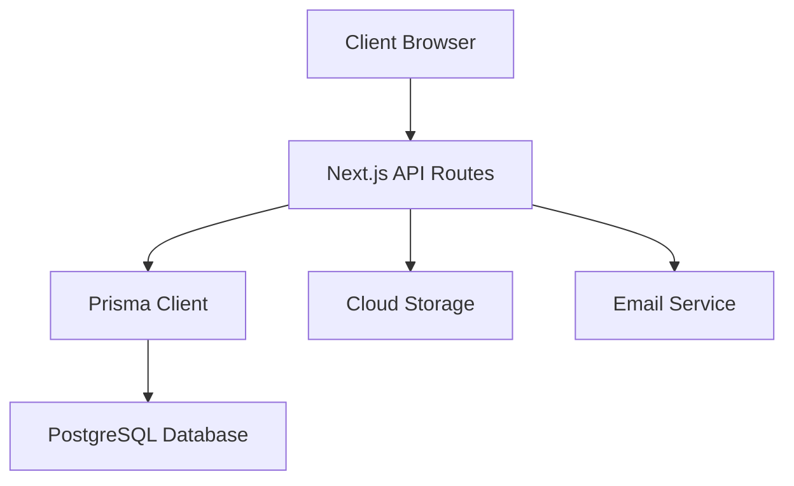
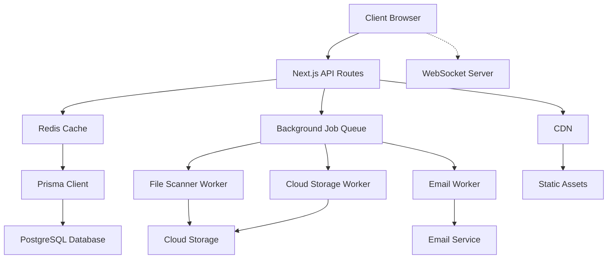

# Website Performance Optimization Plan

## Current Performance Bottlenecks Identified

### 1. Database Layer
- **Multiple sequential queries** in dashboard (portals + uploads)
- **N+1 query problem** in stats calculation
- **Client-side filtering** of recent uploads (last 7 days)
- **No query result caching**

### 2. Frontend Performance Issues
- **Excessive API polling** (every 5-30 seconds)
- **Large bundle size** with all dependencies loaded upfront
- **No code splitting** or lazy loading
- **Client-side data processing** instead of server-side

### 3. Backend Performance Issues
- **Synchronous file scanning** blocking upload responses
- **Email sending** in request thread
- **No background job processing**
- **Sequential cloud storage operations**

### 4. Infrastructure Gaps
- **No caching layer** (Redis/memory)
- **No CDN** for static assets
- **No database connection pooling** optimization
- **No performance monitoring**

## Performance Improvement Roadmap

### Phase 1: Database & Query Optimization ✅ (COMPLETED)

**Status: ✅ COMPLETED**
- Added composite indexes for common query patterns
- Optimized FileUpload queries with (portalId, createdAt) index
- Added indexes for client searches and billing queries

### Phase 2: Caching & API Optimization

#### 2.1 Add Redis Caching Layer
```typescript
// Add to package.json
"redis": "^4.6.0",
"@types/redis": "^4.0.0"

// Environment variables
REDIS_URL=redis://localhost:6379
```

#### 2.2 Implement API Response Caching
```typescript
// lib/cache.ts
import { Redis } from 'redis'

const redis = new Redis(process.env.REDIS_URL!)

export async function getCachedData<T>(
  key: string,
  fetcher: () => Promise<T>,
  ttl: number = 300
): Promise<T> {
  const cached = await redis.get(key)
  if (cached) return JSON.parse(cached)

  const data = await fetcher()
  await redis.setex(key, ttl, JSON.stringify(data))
  return data
}
```

#### 2.3 Optimize Dashboard API Calls
- Combine portals and uploads queries into single endpoint
- Move client-side filtering to server-side
- Cache user-specific dashboard data

### Phase 3: Frontend Optimization

#### 3.1 Bundle Optimization
```typescript
// next.config.ts
const nextConfig: NextConfig = {
  // Enable bundle analyzer
  experimental: {
    optimizePackageImports: ['lucide-react', '@prisma/client']
  },
  // Code splitting
  modularizeImports: {
    'lucide-react': {
      transform: 'lucide-react/{{member}}'
    }
  }
}
```

#### 3.2 Lazy Loading & Code Splitting
```typescript
// app/dashboard/page.tsx
import dynamic from 'next/dynamic'

const StatsOverview = dynamic(() => import('./components/StatsOverview'))
const PortalList = dynamic(() => import('./components/PortalList'))
const RecentUploads = dynamic(() => import('./components/RecentUploads'))
```

#### 3.3 Real-time Updates with WebSockets
Replace polling with WebSocket connections for live updates.

### Phase 4: Backend Processing Optimization

#### 4.1 Background Job Processing
```typescript
// Add to package.json
"bull": "^4.10.0",
"@types/bull": "^4.10.0"

// lib/jobs.ts
import Queue from 'bull'

const uploadQueue = new Queue('file-processing', process.env.REDIS_URL)

export const addFileScanJob = (fileId: string, fileBuffer: Buffer) => {
  uploadQueue.add('scan-file', { fileId, fileBuffer })
}
```

#### 4.2 Async Email Notifications
Move email sending to background jobs to prevent blocking upload responses.

#### 4.3 File Upload Optimization
- Stream file processing instead of loading entire files into memory
- Parallel cloud storage uploads
- Progressive upload status updates

### Phase 5: Infrastructure & Monitoring

#### 5.1 Performance Monitoring
```typescript
// Add to package.json
"@vercel/analytics": "^1.0.0",
"@vercel/speed-insights": "^1.0.0"

// app/layout.tsx
import { Analytics } from '@vercel/analytics/react'
import { SpeedInsights } from '@vercel/speed-insights/next'

export default function RootLayout({ children }) {
  return (
    <html>
      <body>
        {children}
        <Analytics />
        <SpeedInsights />
      </body>
    </html>
  )
}
```

#### 5.2 Database Connection Optimization
```typescript
// lib/prisma.ts
import { PrismaClient } from '@prisma/client'

const globalForPrisma = globalThis as unknown as {
  prisma: PrismaClient | undefined
}

export const prisma =
  globalForPrisma.prisma ??
  new PrismaClient({
    log: ['query', 'info', 'warn', 'error'],
    datasourceUrl: process.env.DATABASE_URL,
  })

if (process.env.NODE_ENV !== 'production') globalForPrisma.prisma = prisma
```

## Architecture Improvements

### Current Architecture


### Optimized Architecture


## Implementation Priority

### High Priority (Immediate Impact)
1. **Database indexes** ✅ COMPLETED
2. **API response caching** (Redis)
3. **Combine dashboard queries** (single endpoint)
4. **Background job processing** (file scanning, emails)

### Medium Priority (Scalability)
1. **Real-time updates** (WebSocket instead of polling)
2. **Bundle optimization** (code splitting, lazy loading)
3. **File upload streaming**
4. **Database connection pooling**

### Low Priority (Monitoring & Polish)
1. **Performance monitoring** (Vercel Analytics)
2. **Error tracking** (Sentry)
3. **CDN optimization**
4. **Image optimization**

## Expected Performance Improvements

- **Database queries**: 60-80% faster with proper indexing
- **API response time**: 50-70% faster with caching
- **Page load time**: 30-50% faster with code splitting
- **Upload processing**: 40-60% faster with background jobs
- **Real-time updates**: Instant instead of 5-30 second polling

## Next Steps

Would you like me to implement any of these optimizations? I recommend starting with:

1. **API caching and query optimization** (Phase 2)
2. **Background job processing** (Phase 4)
3. **Real-time updates** (Phase 3)

Which area would you like to tackle first?